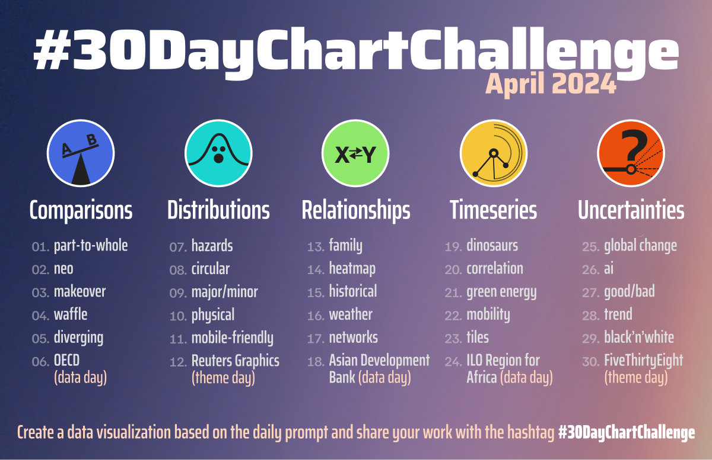

# 30DayChallengue-R-Quarto
Anyone is welcome to contribute, no matter which data source or tool you use. If you share your contributions on X or bsky, please use the hashtag #30DayChartChallenge and/or tag the @30DayChartCall account.

# Topics

This project was created with the R language with the ggplot, Datawrapper and Quarto libraries.

